# Tower Defense Game

A fully documented and modular Tower Defense game built with Flutter and the Flame engine for web.

## Project Overview

This Tower Defense game implements a clean architecture pattern with clear separation between different layers:

1. **Core Layer**: Basic game mechanics and logic
2. **Data Layer**: Data models and sources
3. **Domain Layer**: Business logic and use cases
4. **Presentation Layer**: User interface and interaction

The game features 5 progressive levels with increasing difficulty and an endless mode with unlimited tower types. There are 10 unique tower types with individual properties in the standard levels, and unlimited tower types in the endless mode, each becoming progressively more powerful and expensive.

## Architecture

### Clean Architecture

The project follows Clean Architecture principles with clear separation of concerns:

```
lib/
├── core/         # Core game mechanics and shared utilities
├── data/         # Data models and sources
├── domain/       # Business logic and use cases
└── presentation/ # UI components and screens
```

### State Management

The application uses the BLoC (Business Logic Component) pattern for state management, providing a clean separation between UI and business logic.

## Game Features

- 5 progressive levels with increasing difficulty
- Endless mode with unlimited tower upgrades
- 10 unique tower types with upgrade capabilities
- 10 different enemy types with varying abilities
- Realistic projectile animations
- Visual tower range indicators
- In-game economy for purchasing and upgrading towers

## UML Diagrams

### Game Architecture
```
┌─────────────────┐     ┌─────────────────┐     ┌─────────────────┐
│  Presentation   │     │     Domain      │     │      Data       │
│     Layer       │◄────┤     Layer       │◄────┤     Layer       │
└─────────────────┘     └─────────────────┘     └─────────────────┘
         ▲                      ▲                       ▲
         │                      │                       │
         └──────────────────────┼───────────────────────┘
                               │
                      ┌─────────────────┐
                      │      Core       │
                      │     Layer       │
                      └─────────────────┘
```

### Game Flow
```
┌──────────┐     ┌──────────┐     ┌──────────┐     ┌──────────┐
│  Start   │────►│ Select   │────►│  Play    │────►│ Game     │
│  Game    │     │  Level   │     │  Level   │     │ Over     │
└──────────┘     └──────────┘     └──────────┘     └──────────┘
                                      │  ▲
                                      │  │
                                      ▼  │
                                  ┌──────────┐
                                  │ Pause    │
                                  │ Game     │
                                  └──────────┘
```

### Tower-Enemy Interaction
```
┌──────────┐     ┌──────────┐     ┌──────────┐
│  Tower   │────►│ Detect   │────►│ Fire     │
│          │     │ Enemy    │     │ Projectile│
└──────────┘     └──────────┘     └──────────┘
                                      │
                                      ▼
┌──────────┐     ┌──────────┐     ┌──────────┐
│  Enemy   │◄────┤ Apply    │◄────┤ Hit      │
│  Damaged │     │ Effects  │     │ Detection│
└──────────┘     └──────────┘     └──────────┘
```

## Getting Started

1. Ensure you have Flutter installed and set up for web development
2. Clone the repository
3. Run `flutter pub get` to install dependencies
4. Run `flutter run -d chrome` to start the game in a browser

## Legal

The game includes:
- An imprint with sample data
- A comprehensive privacy policy compliant with GDPR and CCPA

All game data is stored locally without any backend services.

____
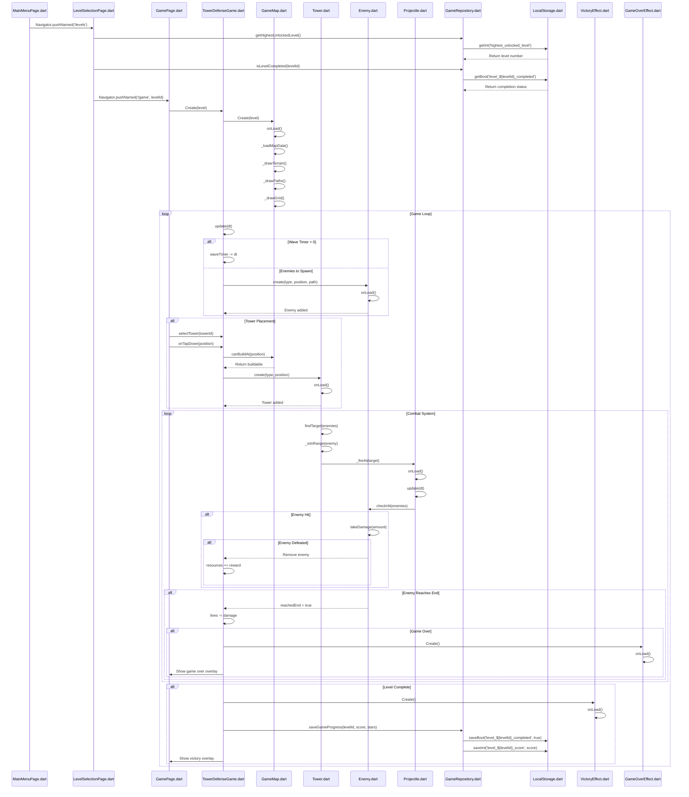


____
# Tower Defense Game

A fully documented and modular Tower Defense game built with Flutter and the Flame engine for web.

## Technical Architecture

### Core Architecture

The game implements a clean architecture pattern with four distinct layers:

1. **Core Layer**
   - Handles fundamental utilities and services
   - Manages dependency injection via GetIt
   - Provides local storage abstraction
   - Contains app-wide constants and themes

2. **Data Layer**
   - Implements repository interfaces
   - Handles data persistence and validation
   - Manages game state storage
   - Provides concrete data source implementations

3. **Domain Layer**
   - Defines business entities and rules
   - Contains repository interfaces
   - Implements core game logic
   - Manages game state transitions

4. **Presentation Layer**
   - Handles UI rendering and user input
   - Manages game rendering via Flame engine
   - Implements game components and effects
   - Provides screen navigation and menus

### Component Architecture

The game uses a component-based architecture for game objects:

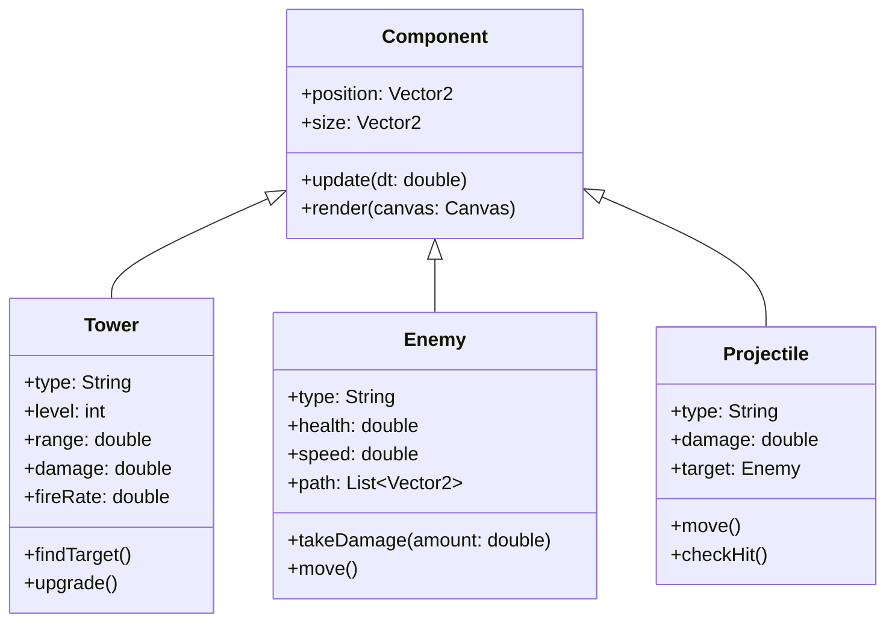

### Game Flow Architecture

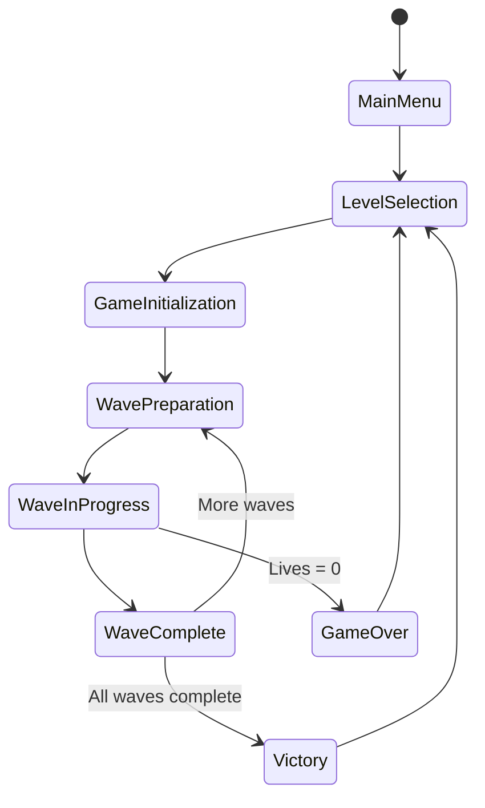

### Tower Interaction System

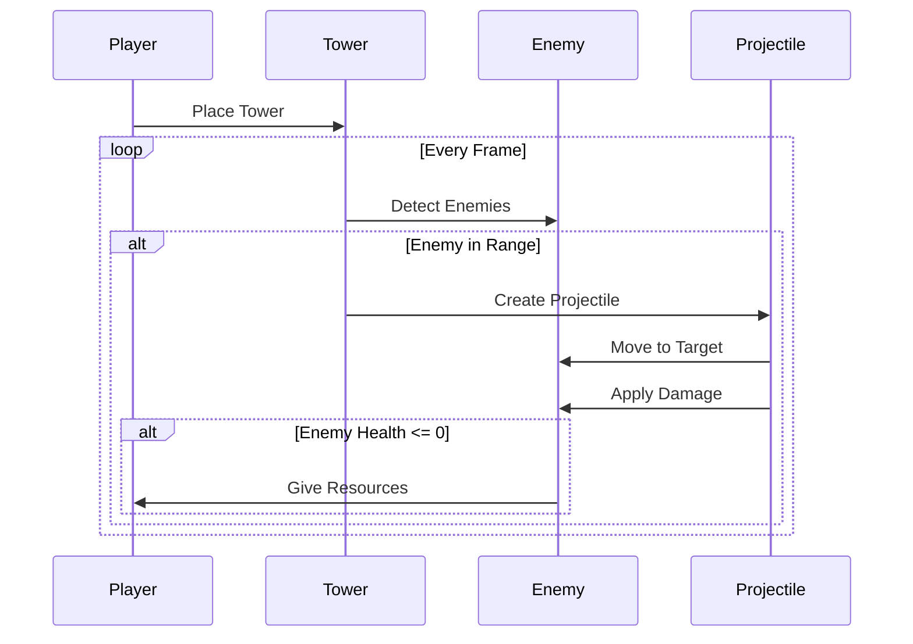

### Repository Pattern Implementation

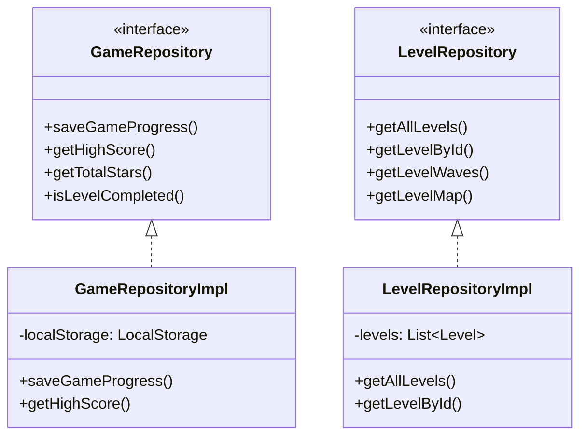

### Enemy Behavior System

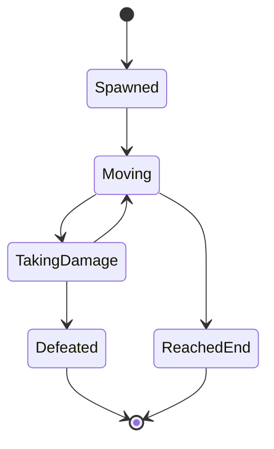

### Tower Upgrade System

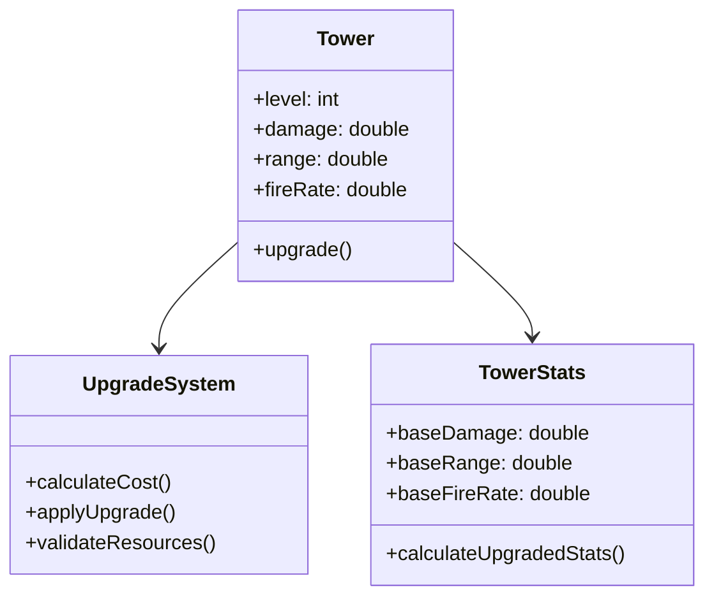

### Wave Management System

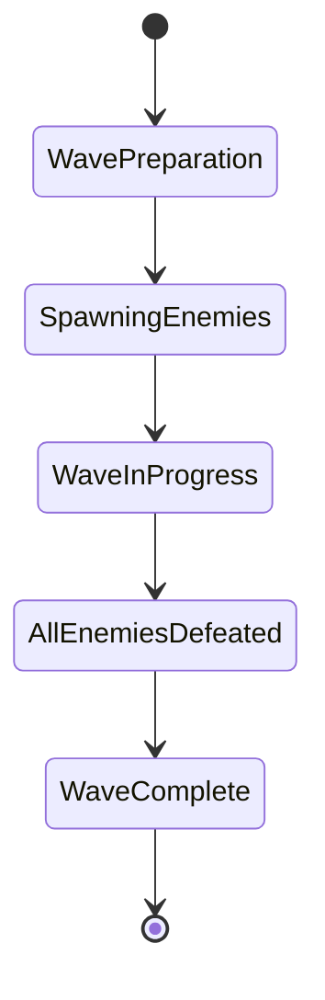

### Resource Management System

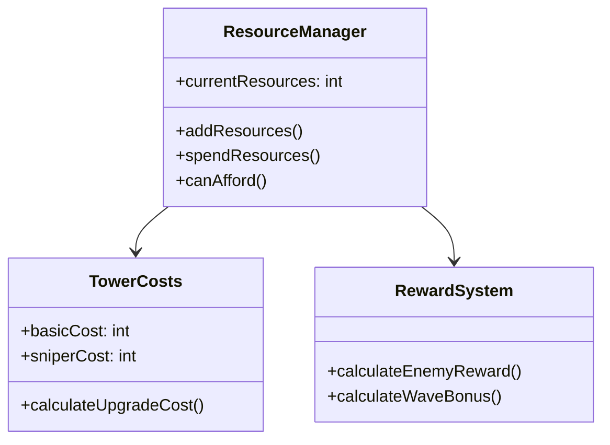

### UI Component Hierarchy

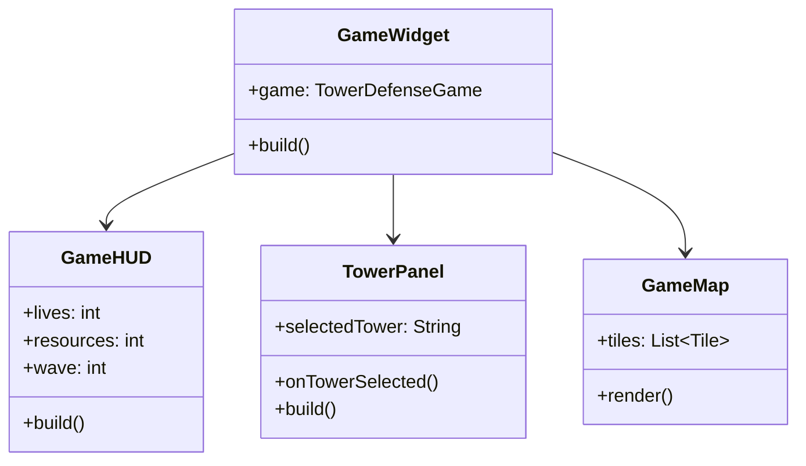

### Effect System Architecture

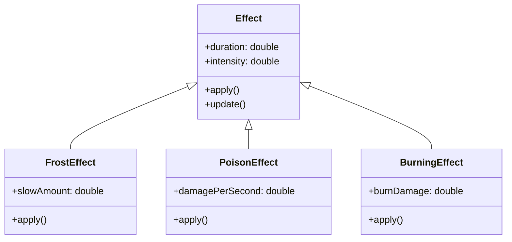

### Audio System Design

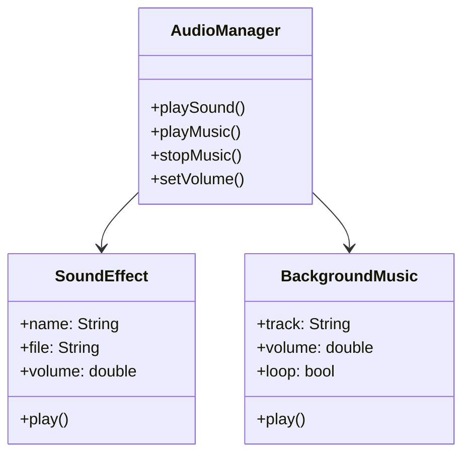

### Save System Architecture

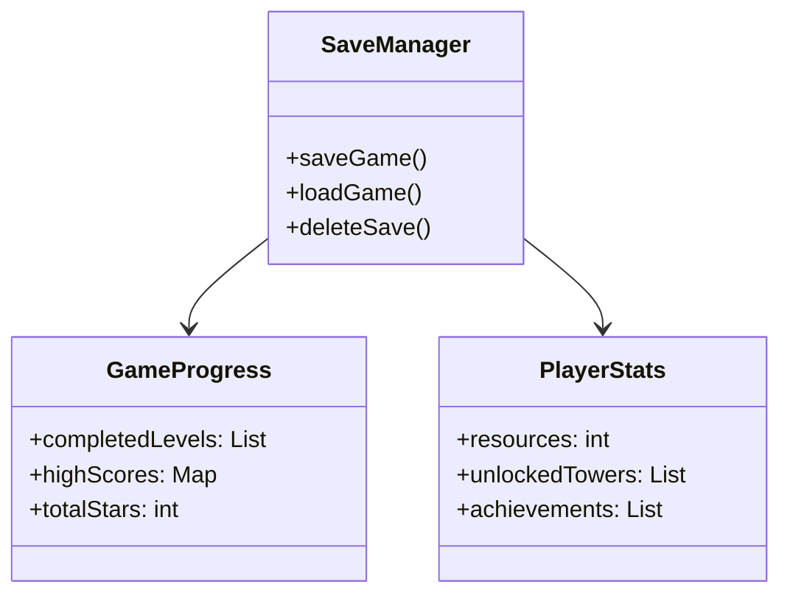

### Level Generation System

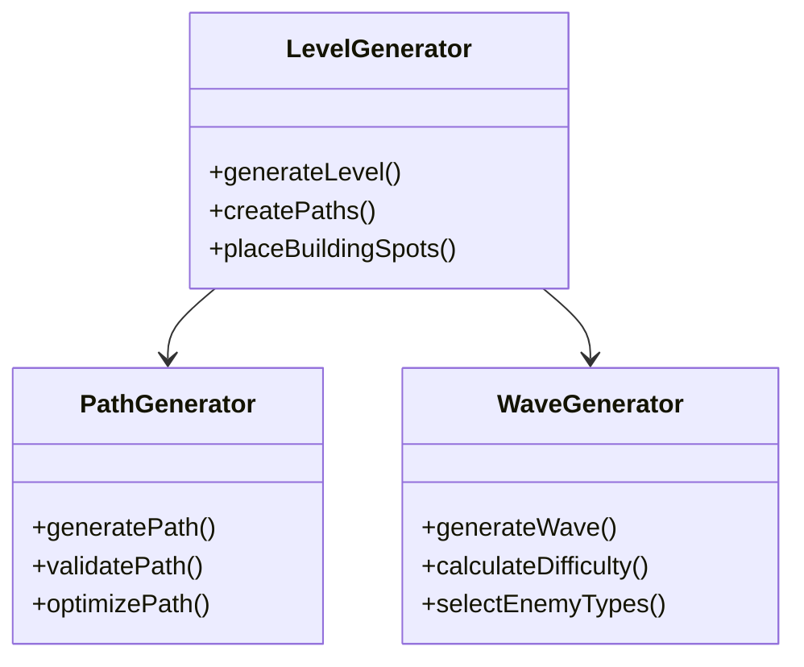

### Particle System Architecture

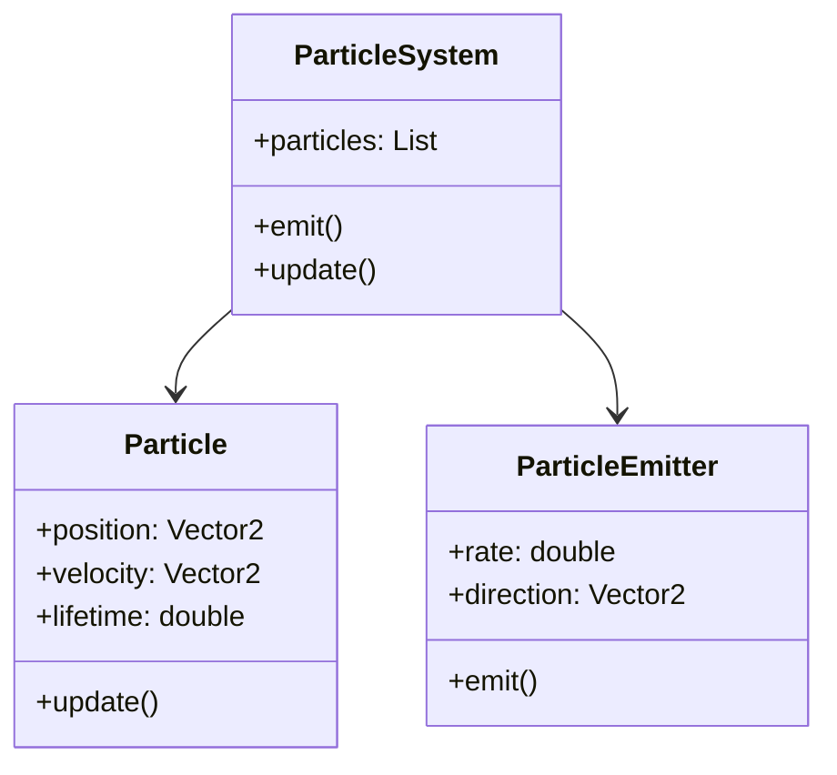

## Technical Implementation Details

### State Management
- Uses GetIt for dependency injection
- Implements repository pattern for data access
- Uses BLoC pattern for UI state management
- Maintains clean separation of concerns

### Game Engine Integration
- Built on Flame game engine
- Uses component-based architecture
- Implements efficient collision detection
- Manages game loop and timing

### Performance Optimizations
- Implements object pooling for projectiles
- Uses quadtree for spatial partitioning
- Optimizes render cycles
- Implements efficient path finding

### Data Persistence
- Uses SharedPreferences for local storage
- Implements repository pattern
- Handles data validation and migration
- Provides async data access

## Architecture Decisions

1. **Clean Architecture**
   - Separates concerns into distinct layers
   - Makes the codebase maintainable and testable
   - Allows for easy feature additions
   - Facilitates testing and debugging

2. **Component-Based Design**
   - Promotes code reuse
   - Simplifies entity management
   - Enables easy feature extension
   - Improves maintainability

3. **Repository Pattern**
   - Abstracts data access
   - Enables easy testing
   - Provides clean data access API
   - Facilitates future backend integration

4. **Dependency Injection**
   - Reduces coupling
   - Improves testability
   - Simplifies dependency management
   - Enables feature toggling

## Performance Considerations

1. **Rendering Optimization**
   - Uses sprite batching
   - Implements view culling
   - Optimizes particle systems
   - Manages texture atlases

2. **Memory Management**
   - Implements object pooling
   - Manages asset loading
   - Controls particle system limits
   - Optimizes texture usage

3. **State Management**
   - Efficient state updates
   - Minimizes rebuilds
   - Optimizes data flow
   - Implements caching

## Future Enhancements

1. **Technical Improvements**
   - Add multiplayer support
   - Implement cloud saves
   - Add advanced pathfinding
   - Enhance particle systems

2. **Architecture Enhancements**
   - Add event system
   - Implement command pattern
   - Add replay system
   - Enhance save system

3. **Performance Optimizations**
   - Implement GPU acceleration
   - Add level streaming
   - Optimize memory usage
   - Enhance rendering pipeline